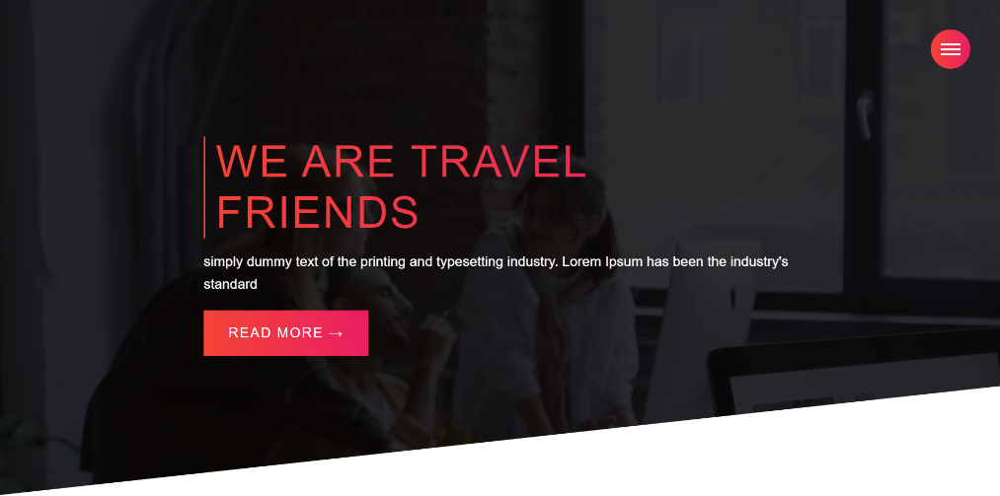
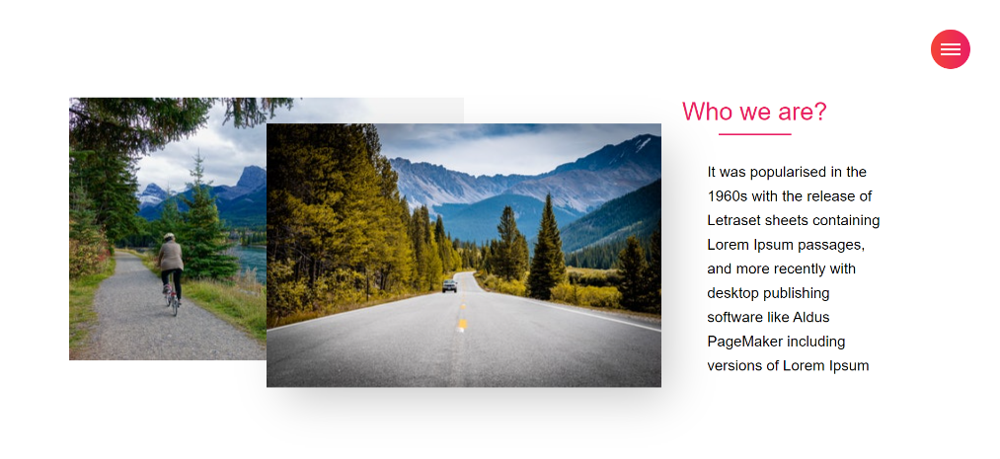
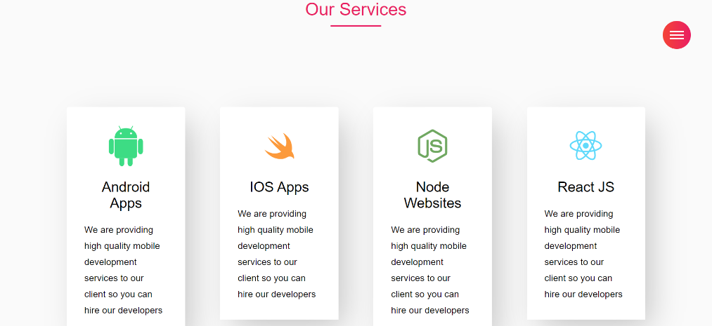
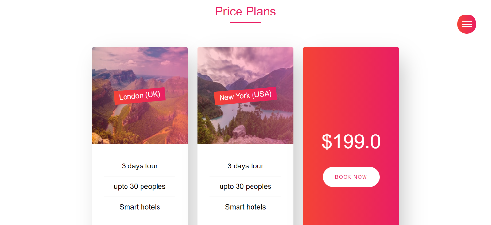
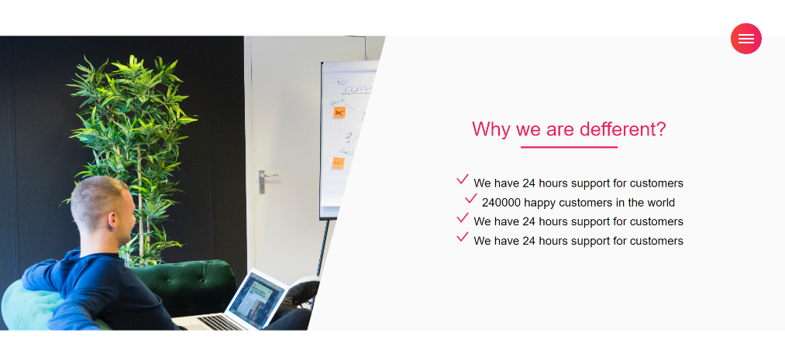
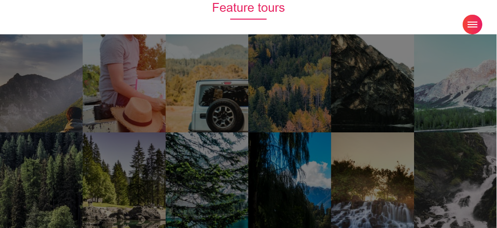
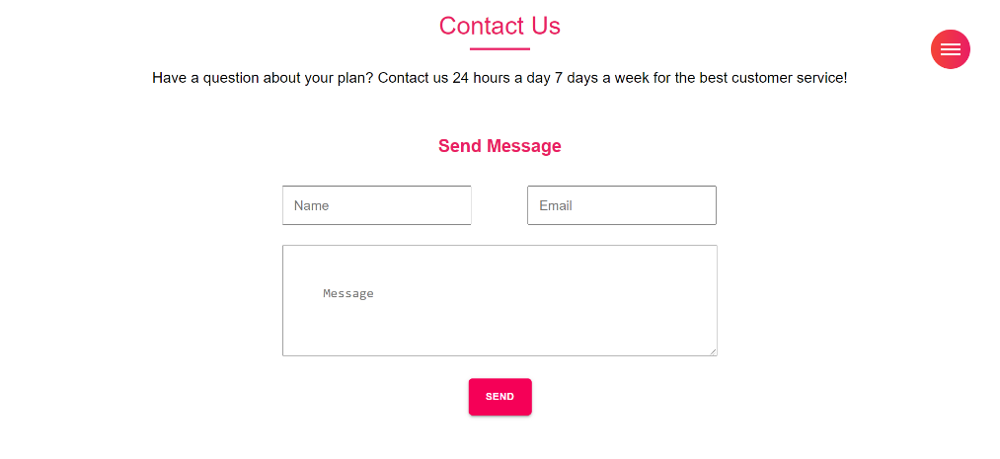
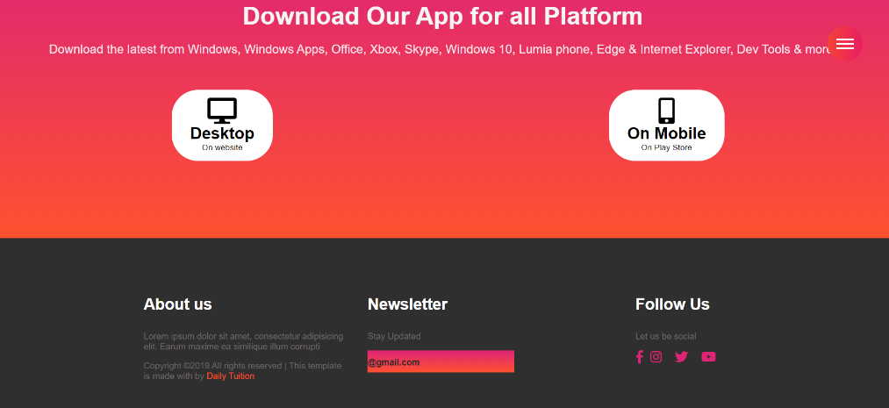

#Responsive Website Travel

Build Travel website with advanced React & JavaScript Nice design of a responsive Travel website 🥗 . It contains a header, home, about, services, app, contact and a footer.

## Screenshots

